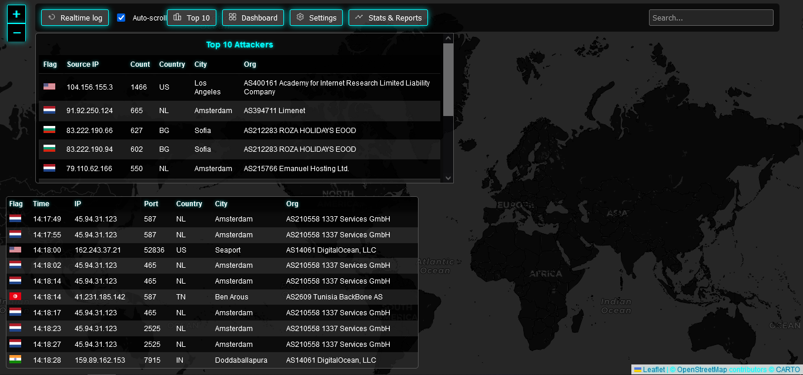

# GeoIP Visualization with FastAPI - Proof of Concept

This project was developed as a **Proof of Concept (PoC)** to explore how we can geolocate connection attempts using **FastAPI** and a **GeoIP database**. The purpose was to visualize where in the world various connection attempts are coming from, offering a visual representation on a map.

Please note that this is a **partial mockup** and not a fully functioning application. The current implementation demonstrates basic functionality of logging connection attempts and plotting their geolocation on a map. You must have a MongoDB running before trying to run the project.

## Project Status
This project is still in its initial stages and lacks certain key architectural components such as:
- Organizing endpoints into **routers** for better separation of concerns.
- Implementing **CRUD** (Create, Read, Update, Delete) operations to handle database entries.
- Defining **schemas** and **models** for MongoDB where relevant to support structured data storage and validation.

While the current project tracks connection attempts, the same approach can be adapted for use in **e-commerce applications**, for instance, to visually represent where customers are making purchases from around the globe.

## Features
- Basic geolocation of connection attempts using [IpInfo](https://ipinfo.io)
- FastAPI as the backend framework for handling requests and serving data.
- MongoDB integration for storing logs and GeoIP information.
- Visualization of connection attempts on a map, showing geolocation of the source IP address.

  
## How to Use
To run the project, follow these steps:

1. **Clone the repository**:
   ```bash
   git clone https://github.com/sofagris/IP-Heatmap.git

2. **Install dependencies**: 
    Ensure you have Python installed. Then install the required Python packages.
    ```bash
    pip install -r requirements.txt

3. **Update your .env file**:
    You can copy the content of dot_env.example and use your own IPIFO_TOKEN
    Register for a free account [here](https://ipinfo.io)

4. **Start the FastAPI server**:
    Run the FastAPI server locally.
    ```bash
    uvicorn main:app --reload

5. **To send data to the API for testing, use the docs page located at <Your server>/docs**
The endpoint for firewall-logs will be /connection and requires:
    - source_ip: str
    - source_port: int
    - dest_ip: str
    - dest_port: int

# Improvements and Next Steps

    - Router Implementation: Split endpoints into logical routers for maintainability.
    - CRUD Operations: Establish basic CRUD functionality to interact with MongoDB.
    - Schemas and Models: Define and validate data models using pydantic for structured data handling.
    - Additional Visualizations: Improve map rendering and add more advanced visual analytics.

# Future Use Cases

Beyond tracking connection attempts, this method can be applied to visualize customer activity in an e-commerce environment, allowing businesses to see where in the world purchases are being made in real time.

## Screenshots 


# Acknowledgments

This project was made with love, and with the invaluable assistance of Chat-GPT and GitHub Copilot.